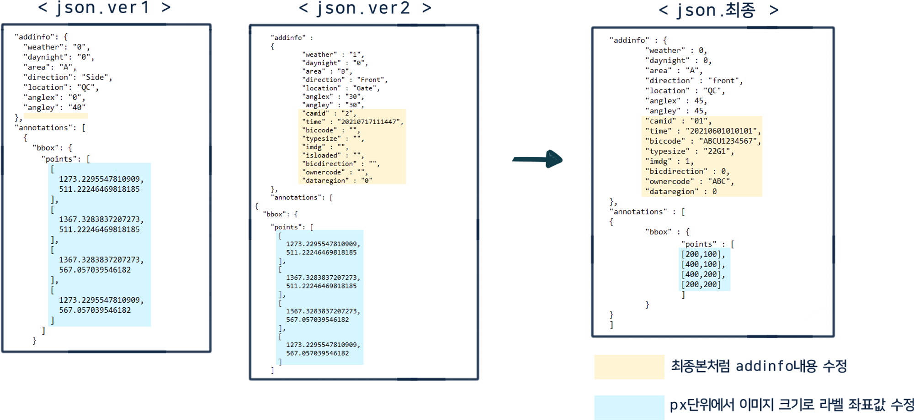

# Json_fix
```
json파일의 내용을 일관화하는 작업 수행
```
## 🐰 역할
- 추가(C)
- 읽기(R)
- 변경(U)
- 삭제(D)
<br>
👉 폴더 내 모든 json읽고 내용 일관화 하여 다시 저장하는 코드
<br>

## 일부 JSON 발췌


<br>
<br>

# Json_csv
```
json파일의 내용을 요구된 format에 맞춰 csv파일로 생성
```
## 🐰 역할
- 기존의 값 df에 저장 (변수명 : dataFrame)
- 새로 추가된 key 생성 후 기존 값 저장한 df에 추가해서 csv 생성 (변수명 : dataFrame_add)
<br>
👉 폴더 내 모든 json읽고 요구된 format에 맞춰 csv형태로 내용을 옮기는 코드